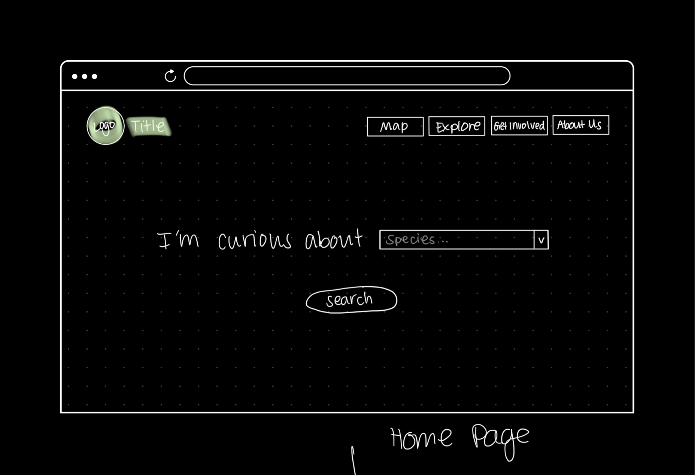
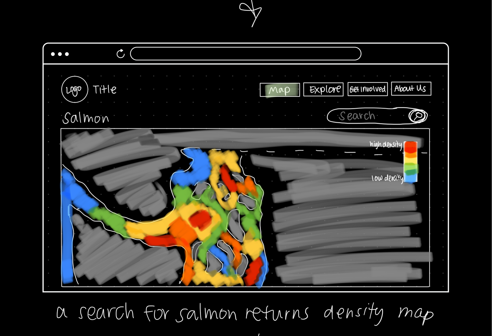

# Design Specification

## Problem

Problem Statement: Puget Sound marine populations have long been in decline or at best hovering at dangerous levels. One of the factors that adversely affects these fish/crustacean populations is the overfishing of vulnerable species by recreational fishers. 

Problem Description: In 2010, the Puget Sound Partnership created a set of initiatives and metrics to monitor the health of Puget Sound, many of which related to Fish populations. In 2021, the agency reported that metrics related to fish health were either short of the 10-year goals or even trending in the reverse direction (PSP, 2021). 

Conventional practices of people who fish recreationally have been contributing to these issues. Declining fish populations will create negative feedback loops in which fishermen will fish more in certain areas, leading to worsening conditions for the fish. 

Issues related to the health of the Puget Sound disproportionately affect ingenious communities who engage with the Puget Sound for sustenance and cultural practices. Not only do fish populations have an influence on the lives of people, but they’re also integral for other sea life in the Puget Sound such as Orcas (Mapes, 2021).

Existing solutions in place attempt to control when and where people fish in Puget Sound throughout the year (eRegulations, 2022). There are ten total zones throughout the Pudget Sound. However, these seasonal zones don’t provide fishing crews with real-time information about how plentiful or vulnerable a particular fish population might be. 

Organizations like the World Wide Fund for Nature attempt to lobby and negotiate with larger fish producers and distributors to affect change on a commercial level, which is critical for fish population safety (Kuruc, 2022). However, these efforts often don’t have trickle-down effects on recreational fishing. 

## Citations

- How to use these eRegulations - washington fishing. eRegulations. (n.d.). Retrieved April 6, 2022, from https://www.eregulations.com/washington/fishing/how-to-use-these-e-regulations
- Kuruc, M. (n.d.). What is overfishing? facts, effects and overfishing solutions. WWF. Retrieved April 6, 2022, from https://www.worldwildlife.org/threats/overfishing#:~:text=It%20can%20change%20the%20size,like%20sea%20 turtles%20and%20 corals.
- Mapes, L. (2019, February 26). Decline of salmon adds to the struggle of Puget Sound's Orcas. Saving Seafood. Retrieved April 6, 2022, from https://www.savingseafood.org/news/conservation-environment/decline-of-salmon-adds-to-the-struggle-of-puget-sounds-orcas/
- Puget Sound Partnership. (n.d.). Thriving species and food web. stateofthesoundwagov. Retrieved April 6, 2022, from https://stateofthesound.wa.gov/thriving-species-and-food-web/

## Solution 

This web application will provide recreational fishermen with accurate recommendations of which regions are best for abundant and sustainable fishing. 

## Site Layout 

Our site will have five pages: a home page, a map of marine area/species information (stretch goal), an explore page where users can find information about marine areas/species, a page where users can get involved in supporting sustainable fishing, and a page about the problem and our mission.

## Design 

### Home 

The home page prompts the user to select the species they are curious about from a drop down menu. Users complete this search by pressing the ‘Search’ button. They will be redirected to the ‘Map’ page, which returns a density map showing where in the Puget Sound the specific species is most frequently found. The home page can be accessed at any point by clicking on the logo or title in the top left corner of the page. Users can also interact with the navigation bar at any point on this page. 

### Map (Stretch Goal) 

The ‘Map’ page displays a density map of the Puget Sound waters depending on the species that was selected by the user. This page can be accessed by either completing the search on the home page or clicking on the respective button in the navigation bar. When entering from a search on the home page, users will automatically see the map for the specific species they searched. If the user is to enter this page through the navigation bar, the map will show a default state until the user searches for a species. A search can be completed in the search bar above the top right corner of the map. The search bar will generate a drop down menu similar to the one on the home page. If a user attempts to drag the map to a different area outside of the Puget Sound, the map will not render as we are only focusing on the Puget Sound area. Users can also interact with the navigation bar at any point on this page. This page is a stretch goal. 

The map is clickable and will provide users with the name of the marine area they select through a pop-up. There will also be a hyperlink within the pop-up, titled ‘Learn More’, prompting users to read more about the marine area. If this link is clicked, users will be redirected to the page displaying information about the selected marine layer. To exit the pop-up, users can click anywhere on the map. Clicking on another area in the Puget Sound will prompt a new pop-up for the marine area, while clicking on the land will close the pop-up entirely. Users can also interact with the navigation bar at any point on this page. This page is a stretch goal. 

### Explore 

The ‘Explore’ page will show the two categories users can further explore, ‘Marine Areas’ and ‘Species’. Users will interact with this page by clicking on either of the categories, which will redirect them to the corresponding subpage. Users can also interact with the navigation bar at any point on this page. 

